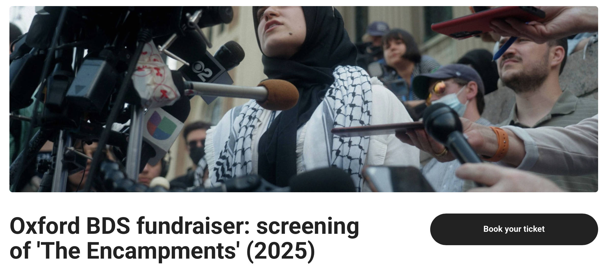
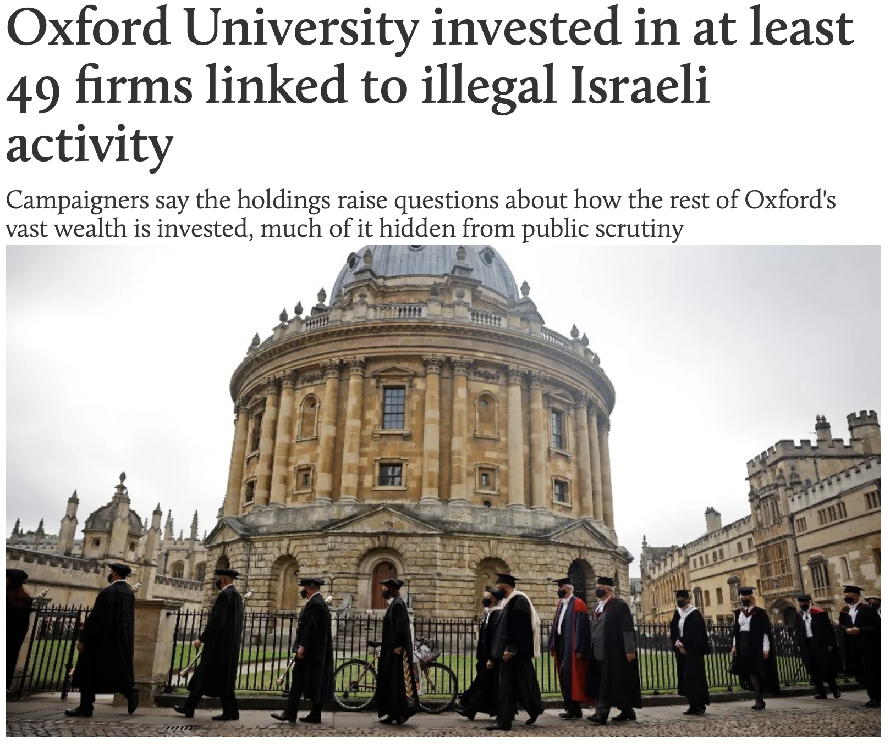

---
# Feel free to add content and custom Front Matter to this file.
# To modify the layout, see https://jekyllrb.com/docs/themes/#overriding-theme-defaults

layout: default_news
title: Oxford BDS Coalition
---

<strong><h3>Actions</h3></strong>

<text style="color:black; font-size:16px;">Staff across the collegiate University are invited to sign the pledge committing to the BDS movement for Palestine.</text>

<a href="bds_pledge.html"><button class="button1"><h4>Sign the Oxford Staff BDS Pledge</h4></button></a>

<text style="color:black; font-size:16px;">We encourage our colleagues to practice giving from a place of solidarity, by engaging with Palestinian mutual aid initiatives.</text>

<a href="mutual_aid.html"><button class="button1"><h4>See Gaza Mutual Aid Initiatives</h4></button></a>

<!--- ------------------------------------------------- -->

<strong><h3>News and Events</h3></strong>

<a href="https://www.tickettailor.com/events/oxfordbdscoalition/1947920"><h3>Oxford BDS fundraiser: screening of 'The Encampments'</h3></a>
<h3>7PM 27th November 2025</h3>

<a href="https://www.middleeasteye.net/news/over-ps19mn-oxford-endowment-invested-49-firms-linked-illegal-israeli-activity"><h3>MEE: Oxford's investments in illegal Israeli activity</h3></a>

16 October 2025

